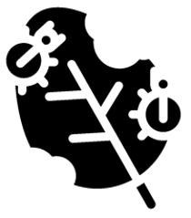

# InvaCost Damage:Management Cost Ratio

National-level prediction and extrapolation of invasive-species costs (ratio of damage:management costs) based on socio-economic traits of countries (data derived from the <a href="https://github.com/Farewe/invacost"><em>InvaCost</em></a> database)

 
Prof <a href="https://globalecologyflinders.com/people/#DIRECTOR">Corey J. A. Bradshaw</a>  
<a href="http://globalecologyflinders.com" target="_blank">Global Ecology</a> | <em><a href="https://globalecologyflinders.com/partuyarta-ngadluku-wardli-kuu/" target="_blank">Partuyarta Ngadluku Wardli Kuu</a></em>, <a href="http://flinders.edu.au" target="_blank">Flinders University</a>, Adelaide, Australia  
October 2022  
<a href=mailto:corey.bradshaw@flinders.edu.au>e-mail</a>  
 
contributors: <a href="https://www.researchgate.net/profile/Philip-Hulme-2">Phil Hulme</a>, <a href="https://carleton.ca/biology/people/emma-hudgins/">Emma Hudgins</a>, <a href="https://www.mcgill.ca/qls/researchers/brian-leung">Brian Leung</a>, <a href="https://www.cee-m.fr/member/courtois-pierre/">Pierre Courtois</a>, <a href="https://www.ese.universite-paris-saclay.fr/en/team-members/franck-courchamp/">Franck Courchamp</a> 
 

## Scripts
- <code>ntlScaleCostDiffInvaCostgithub.R</code>: main R code for analysis
- <code>new_lmer_AIC_tables3.R</code>: source code for information-theoretic algorithms
- <code>r.squared.R</code>: source code for calculating goodness-of-fit for linear models (including mixed-effects models)

## Data
- <em>GDPpc.csv</em>: per capita gross domestic product by country (source: World Bank)
- <em>CPI.csv</em>: corruption perception index (source: Transparency International)
- <em>govexpedu.csv</em>: government expenditure on all education (% of GDP; source: World Bank)
- <em>protarea.csv</em>: proportion of terrestrial surface under some form of protection (source: World Bank)
- <em>faoag.csv</em>: value added proportion of GDP from agriculture, fisheries, and forestry (source: Food and Agriculture Organization of the United Nations)
- <em>continent.countryINVACOST.csv</em> & <em>fao.cntry.code.csv</em> are code files for merging countries and regions across different datasets
